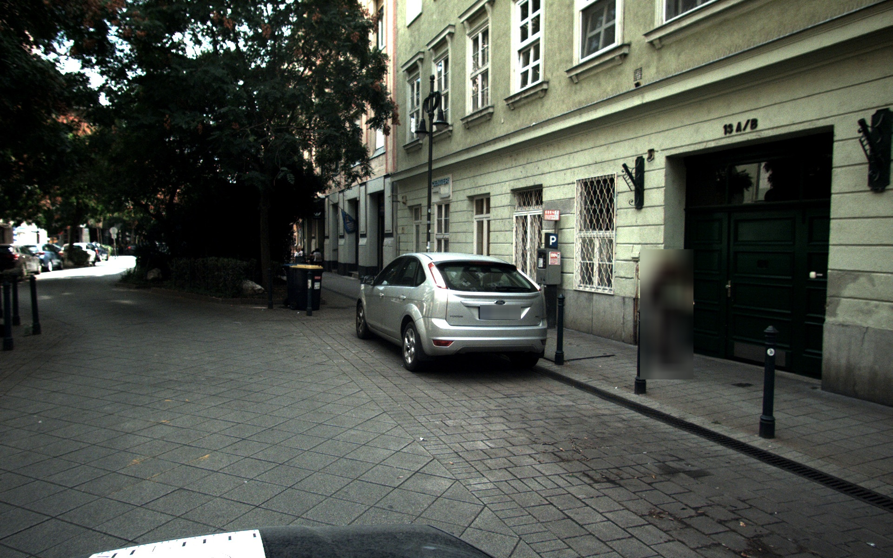
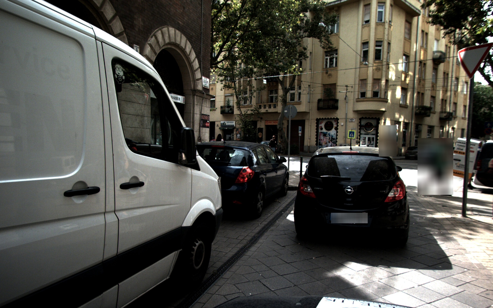
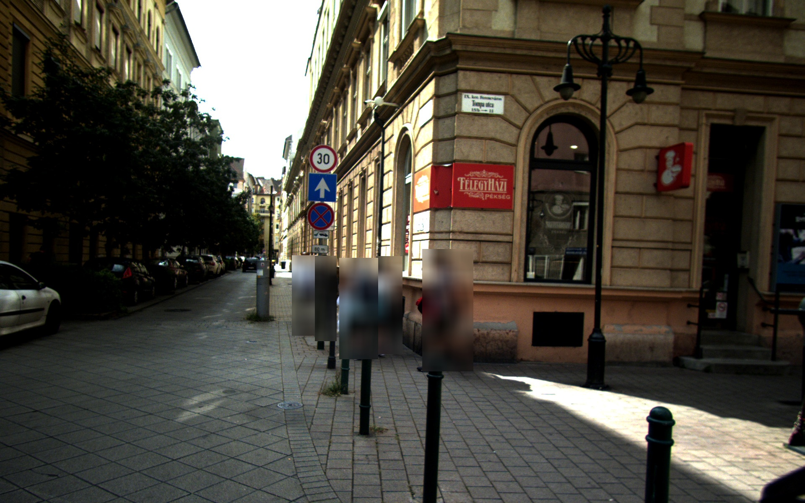
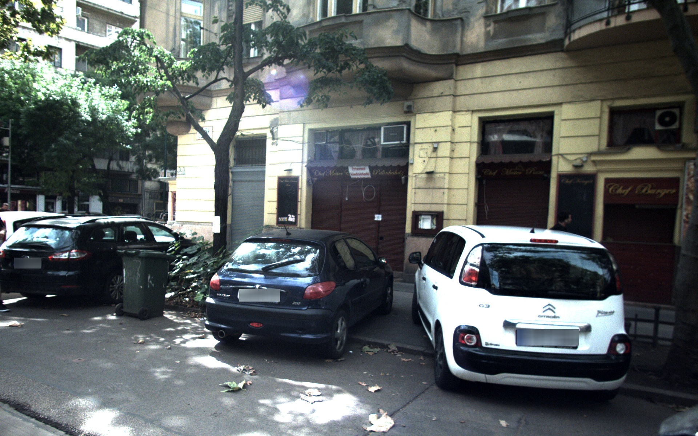

# person_and_licenceplate_blurring

## Installation:
- Python 3.9 or later
- Preferably use a python virtual environment, and install dependencies via pip\
  `pip install -r requirements.txt`
- YOLOv5:  
  In the project's folder `person_and_licenceplate_blurring`, run:  
  `pip install -U ultralytics`
- Clone YOLOv5 repository:  
  In the project's folder `person_and_licenceplate_blurring`, run:  
  `git clone https://github.com/ultralytics/yolov5`

## Usage:

After successfully installind all dependencies, you cen run `python licenseplate_test.py -i <input_folder> -o <output_folder>`\
This will load all images, regardless of their name or format from the **input_folder**, apply the blurring on all detected licenseplates and persons, and save the resulting image in the **output_folder** as *.jpg*.

## Notes:

You should be able to run this the same way on Linux or on Windows. The only difference would be the batch.sh or batch.cmd for batching operations.

## Sample Images:

Below are some example images included in the `img` folder:

### Dev0_Image_w1920_h1200_fn92.jpg

### Dev1_Image_w1920_h1200_fn262.jpg

### Dev3_Image_w1920_h1200_fn155.jpg

### Dev3_Image_w1920_h1200_fn350.jpg

